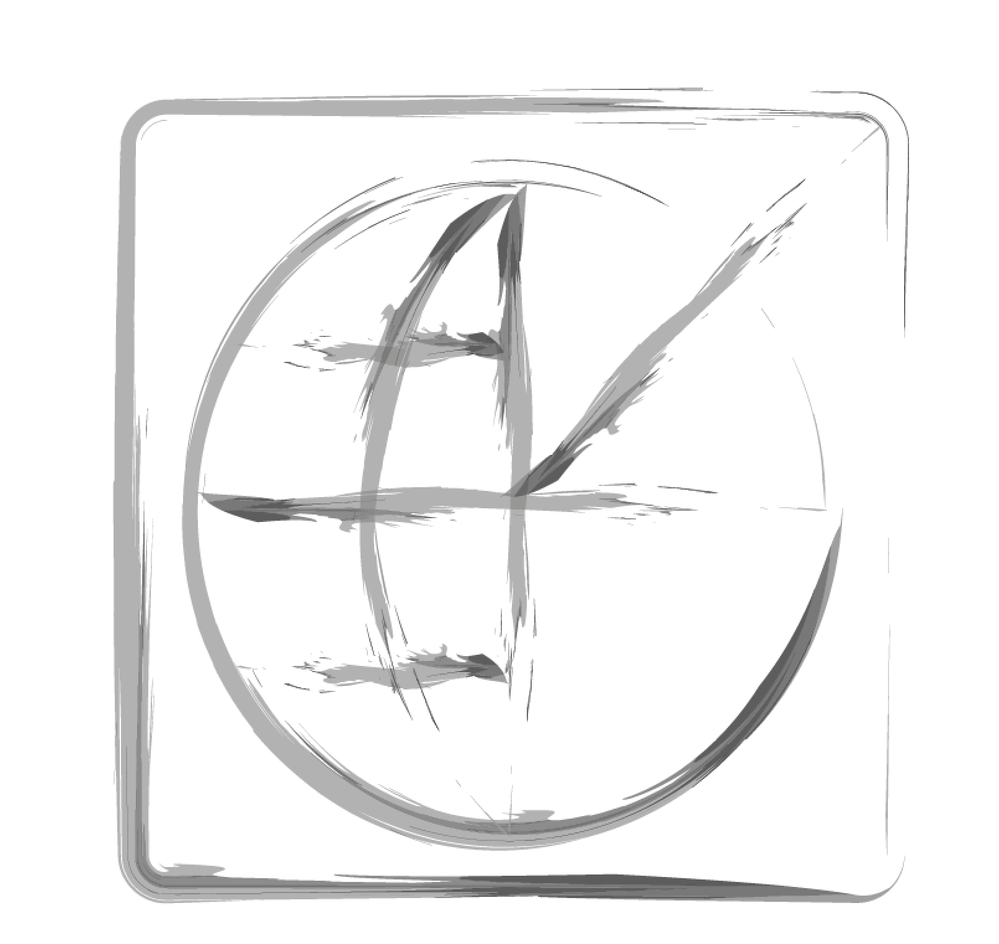

# DSO's Datetime Library for Satellite Geodesy
-----------------------------------------------

[](https://github.com/DSOlab/ggdatetime/actions/workflows/clang-format-check.yml)
[](https://github.com/DSOlab/ggdatetime/actions/workflows/cpp-linux-build.yml)

## Installation

Source code is ISO C++17. Compilation should be trivial using any C++ compiler 
supporting the c++17 standard (option `-std=c++17` in [gcc](https://gcc.gnu.org/) 
and [clang](https://clang.org/)).

The source code also makes use of several C++20 features, and is compliant with the 
C++20 standard, however using this is optional.

Prerequisites:

* A modern C++ compiler,
* [cmake](https://cmake.org/) for building

Installation steps:

* clone the project: `git clone https://github.com/DSOlab/ggdatetime.git`,

* go to the root directory, ``cd ggdatetime`

* use [cmake](https://cmake.org/) to build the library and executables, e.g. 
```
# Step (1)
$> cmake -S . -B build -DCMAKE_BUILD_TYPE=Release
# Step (2)
$> cmake --build build --target all --config Release -- -j4
# Step (3) optionally run tests
$> ctest --test-dir build
## Step (4) Install, system-wide (needs root)
$> cd build && sudo make install
```

### Compilation Options

#### Skip Building Test (Recommended for non-developers)

By default, when building the source code a series of test programs 
will be build. To circumvent this, you can use the `-DBUILD_TESTING=OFF` 
option in Step (1); i.e. change Step (1) to:
```
$> cmake -S . -B build -DCMAKE_BUILD_TYPE=Release -DBUILD_TESTING=OFF
```

#### `ALLOW_DT_INTEGRAL_MATH`

This option will allow (some) selected operations between DateTime fundamental 
types and integral numbers. For example, the following snippet would be valid:
```
Modified_julian_day mjd (123);
mjd += 1;
// Now mjd's internal member, will have a value of 124.
```

By default, this option is not allowed to preserve type-safety.

#### Build in DEBUG mode

You can easily change to building the DEBUG version, e.g. changing 
Steps (1) and (2) to:
```
$> cmake -S . -B build -G "Unix Makefiles" -DCMAKE_BUILD_TYPE=Debug
$> cmake --build build --target all --config Debug -- -j4
```

## Fundamental Date and Time Classes

To preserve type-safety, the library goes on to define a series of classes to 
represent dates and time, i.e.

### Time Integral Types

* dso::hours
* dso::minutes
* dso::seconds
* dso::milliseconds, i.e. $$10^{-3} sec$$
* dso::microseconds, i.e. $$10^{-6} sec$$
* dso::nanoseconds, i.e. $$10^{-9} sec$$
* dso::picoseconds, i.e. $$10^{-12} sec$$

### Time Fractional Types

* dso::FractionalSeconds
* dso::FractionalDays
* dso::FractionalYears

### Date Integral Types

* dso::year
* dso::month
* dso::gps_week
* dso::day_of_month
* dso::day_of_year
* dso::modified_julian_day 
* dso::ymd_date, i.e. a calendar date
* dso::ydoy_date, i.e. a date represented as Year and Day-of-Year

## Representing Datetime Instances

In order to represent datetime instances, i.e. **epochs**, we have to make a 
distinction between **contunuous** and **non-continuous** time scales. For example, 
UTC is a non-continuous time scale, since every now and then leap seconds are 
introdiced.

### Epochs in Continuous Time-Scales

In continuous time scales (e.g. TT, TAI, etc, ...) an epoch can be represented 
in two ways:

* using a dso::TwoPartDate (or its alias name dso::MjdEpoch); this way of representing 
  an epoch, includes storage of two numerics: an integral part, which is actually the 
  day as Modified Julian Day and a floating point part which represents the seconds of day.

* using the template class dso::datetime (or its alias name dso::Datetime) which 
  depends on a template parameter \p T. This parameter denotes the precision in which 
  the datetime is 'measured' and it can be any of the [Time Integral Types](#time-integral-types) 
  that are multiples of seconds. E.g., you can have a `dso::datetime<dso::milliseconds> t(...)`.
  In this way, it is guaranteed that the specified accuracy will be preserved, since 
  no floating point math are involved when e.g. adding or subtracting second multiples. 
  Note however that precision is lost if you add a 'more accurate' subdivision of 
  seconds to a leeser one, e.g.
  ```
    dso::datetime<dso::milliseconds> t(...);
    t.add_seconds(picoseconds(1));
  ```

### Epochs in Continuous Time-Scales aka UTC

## Leap Seconds

Leap seconds are introduced as necessary to keep UT1-UTC in the $$\pm 0^{s}.9$$. 
Because on the average the solar day is now 1-2 ms longer than the nominal 
86,400 SI seconds, accumulating to 1s over a period of 18 months to a few years, 
leap seconds are in practice always positive ([see SOFA](#sofa_ts)). Each time 
a leap second is introduced, the offset $\Delta$AT = TAI - UTC changes by exactly 1s. 
Insertion of leap seconds, make UTC a non-continuous time scale, which should be 
handled-specially-(see-[Epochs-in-Continuous-Time-Scales-aka-UTC](#epochs-in-continuous-time-scales-aka-utc)).

> [!CAUTION]
> **Latest leap second considered in datetime library occured at: 2017/01/01**

## Executables 

Along with the library, the project builds by default a small set of executables/programs that 
perform fundamental date transformations. These are:
* ymd2mjd
* mjd2ymd
* mjd2ydoy
* ydoy2mjd

They came with help, which can be triggered by the `-h` switch (e.g. `$> ymd2mjd -h`), listing 
options and usage instructions. They all except input from STDIN and write results to 
STDOUT, so you can [pipe](https://en.wikipedia.org/wiki/Pipeline_(Unix)) results and input. 

By default, the programs will be installed at `/usr/local/bin` on Linux systems.

The following examples should be self explanatory:

```
$> cat dates
2014:01:09
2014:01:9
2014:1:09
2014:01:08
2014:01:07
2014:01:0
2014:01:1
2014T01:1
2014TT01:1
2014:01:1with some string
2014/01/1with some string
$> cat dates | ymd2mjd
56666
56666
56666
56665
56664
ERROR. Failed parsing/transforming line: 2014:01:0
56658
56658
ERROR. Failed parsing/transforming line: 2014TT01:1
56658
56658
$> cat dates | ymd2mjd | mjd2ymd
ERROR. Failed parsing/transforming line: 2014:01:0
ERROR. Failed parsing/transforming line: 2014TT01:1
2014/01/09
2014/01/09
2014/01/09
2014/01/08
2014/01/07
2014/01/01
2014/01/01
2014/01/01
2014/01/01
$> cat dates | ymd2mjd | mjd2ydoy 
ERROR. Failed parsing/transforming line: 2014:01:0
ERROR. Failed parsing/transforming line: 2014TT01:1
2014/009
2014/009
2014/009
2014/008
2014/007
2014/001
2014/001
2014/001
2014/001
$> echo "2008:32" | build/ydoy2mjd  | build/mjd2ymd
2008/02/01
```

### Documentation  

## Time Scales  

To achieve high precision in calculations involving time variables and phenomena related to Earth's rotation and planetary motion, different time scales are introduced:  

- **GPST (GPS Time)**:  
  Continuous atomic time scale implemented by the atomic clocks in GPS ground control stations and the GPS satellites themselves.  
  - Reference epoch: $t_0 = 0^{h} 0^{m} 0^{s}$, 6 January 1980 (JD = 2444244.5) 
  - Units: SI seconds - counting in weeks and seconds of the week  

- **TT (Terrestrial Time)**:  
  A theoretical time scale for clocks located at sea level.  

- **TAI (International Atomic Time)**:  
  Continuous atomic time scale independent of astronomical phenomena, apart from being initially synchronized with solar time.  
  - Reference epoch: \( t_0 = 0\,\text{h} \, 0\,\text{m}, 0\,\text{s}), 1 January 1958  
  - Units: Seconds  

- **UTC (Coordinated Universal Time)**:  
  Atomic time that incorporates leap seconds to maintain alignment with the Sun.  

- **UT1 (Universal Time)**:  
  Time scale without leap seconds, with a variable rate due to Earth's slightly irregular rotation period.  

## Time Scales Relationships

The transformation from a given time scale to another can be calculated using the following formulas:

### Notes:
- $\Delta AT = TAI - UTC$ (leap seconds)
- \( \text{DUT1} = \text{UT1} - \text{UTC} \) (Earth Orientation Parameters)
- \( \text{DTT} = \text{TT} - \text{UTC} \)
- \( \text{DT} = \text{DAT} - \text{DUT1} + 32.184 \, \text{s} \)

---

### GPS Time

- **GPS to TAI**:  
  \[ \text{TAI} = \text{GPS time} - 19.000 \, \text{s} \]
- **GPS to TT**:  
  \[ \text{TT} = \text{GPS time} - 19.000 \, \text{s} + 32.184 \, \text{s} \]  
  \[ \text{TT} = \text{GPS time} + 13.184 \, \text{s} \]
- **GPS to UTC**:  
  \[ \text{UTC} = \text{GPS time} - \text{DAT} - 19.000 \, \text{s} \]
- **GPS to UT1**:  
  \[ \text{UT1} = \text{GPS time} - \text{DAT} + \text{DUT1} - 19.000 \, \text{s} \]

---

### TAI (International Atomic Time)

- **TAI to GPS**:  
  \[ \text{GPS time} = \text{TAI} + 19.000 \, \text{s} \]
- **TAI to TT**:  
  \[ \text{TT} = \text{TAI} + 32.184 \, \text{s} \]
- **TAI to UTC**:  
  \[ \text{UTC} = \text{TAI} - \text{DAT} \]
- **TAI to UT1**:  
  \[ \text{UT1} = \text{TAI} - \text{DAT} + \text{DUT1} \]

---

### TT (Terrestrial Time)

- **TT to GPS**:  
  \[ \text{GPS time} = \text{TT} - 13.184 \, \text{s} \]
- **TT to TAI**:  
  \[ \text{TAI} = \text{TT} - 32.184 \, \text{s} \]
- **TT to UTC**:  
  \[ \text{UTC} = \text{TT} - \text{DTT} \]
- **TT to UT1**:  
  \[ \text{UT1} = \text{TT} + \text{DT} \]

---

### UTC (Coordinated Universal Time)

- **UTC to GPS**:  
  \[ \text{GPS time} = \text{UTC} + \text{DAT} + 19.000 \, \text{s} \]
- **UTC to TAI**:  
  \[ \text{TAI} = \text{UTC} + \text{DAT} \]
- **UTC to TT**:  
  \[ \text{TT} = \text{UT1} - \text{DT} \]
- **UTC to UT1**:  
  \[ \text{UT1} = \text{UTC} + \text{DUT1} \]

---

### UT1 (Universal Time) 

- **UT1 to GPS**: 
  \[ \text{GPSTime} = \text{UT1} + \text{DAT} - \text{DUT1} + 19.000 \, \text{s} \]
- **UT1 to TAI**: 
  \[ \text{TAI} = \text{UT1} + \text{DAT} - \text{DUT1} \]
- **UT1 to TT**: 
  \[ \text{TT} = \text{UT1} - \text{DT} \]
- **UT1 to UTC**: 
  \[ \text{UTC} = \text{UT1} - \text{DUT1}\]


## ToDo:

* [] Add documentation

## For Developers

Take a look at the [LLVM Coding Standards](https://llvm.org/docs/CodingStandards.html) 
and if possible stick to it. 





## Bibliography

1. <a id="sofa_ts"></a> International Astronomical Union, Standards of Fundamental Astronomy, SOFA Time Scale and Calendar Tools, Document revision 1.63, 2023
